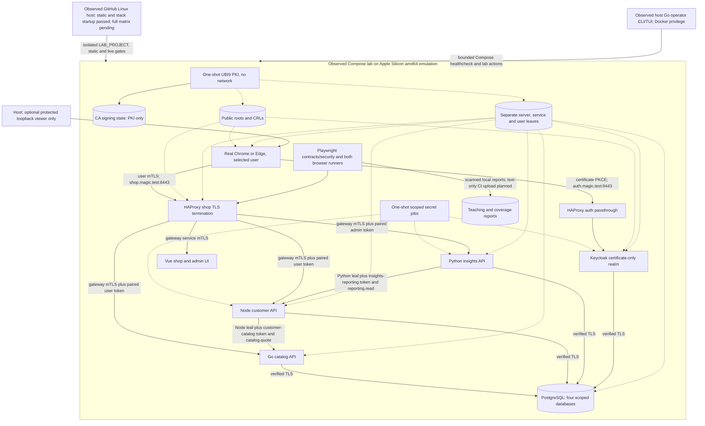
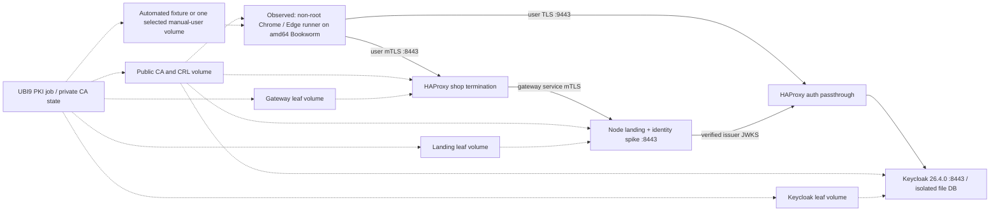
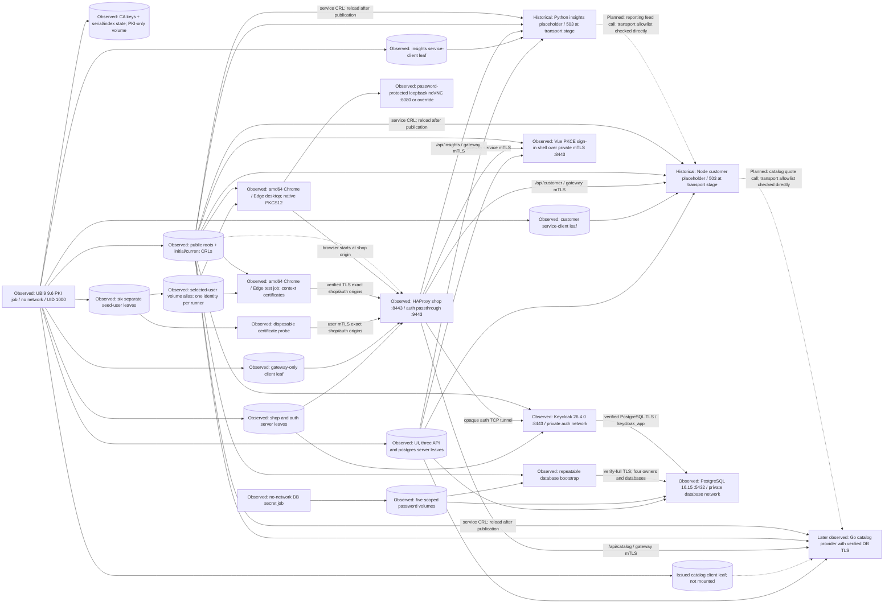

# Architecture and implementation decisions

Status: Prompts 01–10 run PKI, PostgreSQL, HAProxy, an integrated Vue UI, live Go catalog, Node customer and Python insights providers, real Chrome/Edge runner profiles including the selected-user manual desktop, a certificate-only Keycloak realm with six seed users, and a private local package exercised by both test runners. The Vue UI uses Keycloak Authorization Code + PKCE and memory-held tokens. Customer checkout/widgets and administrator regional reporting/follow-ups passed in both real Chrome and Edge on Apple Silicon emulation. All three providers validate signed user requests; Go and Node pair scoped service requests with caller certificates. Native Linux GitHub verification has started but the full matrix remains unverified.

The Prompt 11 teaching slice now shares Saturday page/element/login flow models between Playwright Test and Cucumber. Both runners passed customer and admin examples in both branded browsers. Separate customer Chrome and admin Edge jobs also passed concurrently with two Playwright workers each and distinct local reports. Isolated signing-key rotation and signed JWT-01 negative-claim checks passed live against all three long-running APIs. Prompt 12 defines a Linux CI gate and passed its containerized static, contract, security and eight browser/runner/identity selections locally on Apple Silicon emulation. The first GitHub Linux run passed static jobs and isolated stack startup, then stopped at an unavailable old Chrome pin; contracts and browser suites remain unverified there pending rerun. Both current Compose viewer identities were human-confirmed on Apple Silicon.

Prompt 13 adds a host Go operator built in a pinned container with Bubble Tea, Bubbles and Lip Gloss. Its Apple Silicon status, healthcheck and certificate metadata paths are observed. The healthcheck requires all seven core services healthy and checks the optional manual viewer when present; ephemeral test runners are judged by their exit status. The trusted host process invokes Docker Compose and the existing `lab` test commands; no application or runner receives a Docker socket. Native Linux remains unverified.

## Topology

Diagram omits several per-service credential mounts and token/JWKS calls for readability. The authentication document defines those boundaries. See [infrastructure and workflow diagrams](workflows.md) for the expanded topology, startup, authentication, business requests and runner lifecycle.

The observed GitHub CI host invoked Docker without receiving a certificate or signing key. Its isolated project created certificate volumes and bootstrapped the realm. Static OpenAPI checks passed there; live Playwright contracts/security and browser suites were not reached because the old Chrome pin disappeared from Google's signed apt index. The updated exact Chrome pin passed a fresh local runner build and targeted browser checks; the native rerun is pending. Only credential-scanned text results are eligible for upload, while WebM and HTML/video bundles remain local. Artifact upload remains unverified.

The Vue UI serves behind verified gateway mTLS, starts certificate-only Keycloak PKCE, shows the selected identity and role, and keeps tokens in memory. Its catalog, profile/orders/widgets, checkout and admin paths reach all three live providers. Customer, shopkeeper inventory and administrator journeys passed in both real Chrome and Edge with local video recordings, including persisted widgets/notes, synced regional reporting, item details and offline map. Native NSS certificate stores and both runner adapters were proved earlier.

| Compose service | Responsibility | Current base / remaining plan |
| --- | --- | --- |
| `ui` | Vue certificate sign-in, shop/cart/checkout, account, inventory and admin/reporting screens backed by three live providers | Pinned Node 24.10 Bookworm builder/runtime; keycloak-js 26.2.4 |
| `keycloak` | Certificate-only realm, six users, token issuance and verified database TLS | Pinned official Keycloak 26.4.0 image |
| `customer-api` | Observed seeded profiles/orders, owned checkout, widgets, admin lists, revisioned private reporting, JWT/certificate pairing and authenticated spec | Pinned Node 24.10 Bookworm; pg 8.23.1, jose 6.2.12 |
| `catalog-api` | Observed seeded browse/detail, item maintenance, private quotes, JWT/certificate pairing and authenticated spec | Pinned Go 1.25.3 Bookworm build, UBI9 runtime; pgx 5.11.0, golang-jwt 5.3.1 |
| `insights-api` | Observed admin-only regional sales, GeoJSON, customer/order summaries and local follow-up persistence through Node's bounded feed | Pinned UBI9 Python 3.12; PyJWT 2.15.1, psycopg 3.2.13 |
| `gateway` | Shop mTLS, private backend mTLS and auth passthrough | Pinned HAProxy 3.2.6 image |
| `runner-test` / `runner-manual` | Same image; real Chrome/Edge, one selected-user mount; shared Saturday Playwright Test and Cucumber customer/admin journeys, plus Playwright shopkeeper inventory, observed | Pinned Node 24.10 Bookworm linux/amd64; signed browser packages; Playwright FFmpeg 1011 for local video |
| `runner-contracts` / `runner-security` | Browserless OpenAPI gate with scoped service callers; separate security job with customer, second-customer and shopkeeper user leaves only | Same pinned runner image; no host certificate or signing-key mounts |
| `runner-service-revocation` / `runner-user-validity` | Isolated negative-fixture jobs for revoked/dated service leaves and dated user leaves; each receives public trust plus only its named leaf and required catalog secret | Same pinned runner image; fixture keys remain in Docker volumes and issuer key remains PKI-only |
| `runner-reporting-scope` / `scope-fixture-admin` | Isolated reporting-scope check with only the Python caller leaf, reporting client secret and public trust; the catalog check reuses `runner-service-revocation` with its Node caller leaf. A separate admin-only job removes one default grant in a disposable realm | Runner uses the pinned amd64 browser image; the scope fixture uses the pinned Node bootstrap image with only public trust and the admin secret |
| `runner-key-rotation` / `key-rotation-admin` | Isolated certificate-backed PKCE and three-API probe before/after a generated Keycloak signing-key rotation; a separate admin-only job changes the disposable realm | Runner mounts only the shop-admin leaf and public trust; admin job mounts only the admin secret and public trust; no host trust change |
| `postgres` | Four distinct databases/owners with TLS and persistent volume | Pinned official PostgreSQL 16.15 Trixie image |
| `pki` | Container-only issuance, renewal, revocation and CRLs | Pinned UBI9 9.6 with OpenSSL; no network |
| `auth-secrets` / `realm-bootstrap` | Generate isolated admin/service secrets; idempotently apply realm, users, roles, scopes and clients | Pinned UBI9 9.6 and Node 24.10 containers |

The default profile has seven long-running services: UI, Keycloak, three APIs,
HAProxy and PostgreSQL. PKI, database secrets and database bootstrap are
completed jobs. Either optional runner profile adds one container. The manual
profile is recreated for a different user and only publishes a protected
loopback viewer. No host-installed runtime or certificate tooling is required
beyond Docker Compose and a shell.

## Network and origins

- Container DNS aliases on HAProxy: `shop.magic.test` and `auth.magic.test`.
- Shop origin: `https://shop.magic.test:8443`; issuer: `https://auth.magic.test:9443/realms/magic-shop`.
- The exact origins, server SANs and Playwright certificate mappings passed the
  Prompt 03 Chrome/Edge transport smoke checks and Prompt 04 PKCE logins.
- HAProxy binds two internal listeners: shop HTTPS termination and Keycloak TCP passthrough. Its backend server names refresh through Docker DNS after a service container is recreated, while backend TLS still verifies each server name and CA.
- `/api/catalog/*` routes to Go; `/api/customer/*` to Node; `/api/insights/*` to Python; other shop paths serve the UI. Preserve path prefixes consistently in each OpenAPI contract.
- All callers use the canonical issuer URL for discovery/tokens/JWKS. Do not switch between `localhost`, container names, and external issuer strings.
- Keycloak belongs to a private proxy network; its HTTPS port is not published to the host. Service callers reach it through HAProxy's auth listener. Unknown paths on the shop API namespace return an API 404, not the SPA shell.
- Business backend ports and database ports are internal only. Separate private backend/DB networks; container health endpoints are not routed publicly.
- The canonical OpenAPI contracts name private HTTPS service origins
  `https://catalog-api:8443`, `https://customer-api:8443`, and
  `https://insights-api:8443`. All listeners and SANs exist. Go serves six
  catalog operations, Node serves ten customer operations and Python serves seven insights operations.
- Only the optional manual viewer publishes on `127.0.0.1`, default port 6080
  (configurable when occupied). No host DNS or trust-store changes are needed.
- Configure Keycloak passthrough without trusting HTTP forwarded headers. If using PROXY protocol, enable it on both ends and confine the connection to HAProxy's private network. Record the chosen behavior in the spike.

## Domain and service ownership

| Owner | Records | Public operations | Internal operations |
| --- | --- | --- | --- |
| Go catalog | Items, item categories, display stock | Paginated browse/detail; shopkeeper/admin item create/update/archive | Node service may batch-resolve current item IDs and prices |
| Node customer/orders | Customer profile keyed by Keycloak `sub`; order and immutable lines; dashboard widget layout | Own profile, own orders, simulated checkout, own widget layout; admin customer/order lists | Python service may request paginated reporting snapshots |
| Python insights | Region definitions, follow-up notes; derived sales/read models if needed | Admin sales summaries, region-filtered users/orders, map data, follow-up notes | Reads Node reporting feed using its own constrained service identity |
| Keycloak | Users, login identity mapping, roles, service clients | OIDC flows | Operator-controlled setup API only |

The three [canonical OpenAPI 3.1 contracts](../contracts/openapi/README.md) define the interfaces: Go implements six catalog operations, Node ten customer operations and Python seven insights operations. The [domain and contract design](domain-contract-design.md) records terms, ownership and authorization and is not a second canonical specification. All three package resolved documents, check operation/transport fields, and pass live browserless Playwright contracts. The 23-operation status gate passed on Apple Silicon emulation. See [API contract requirements](api-contracts.md) for the remaining CI gate.

Canonical operation groups now specified for later implementation:

- `GET/POST /api/catalog/items`, `GET/PATCH /api/catalog/items/{id}`, `DELETE /api/catalog/items/{id}` (archive).
- `GET/PATCH /api/customer/me`, `GET/POST /api/customer/orders`, `GET /api/customer/orders/{id}`.
- `GET /api/customer/admin/users`, `GET /api/customer/admin/orders` with cursor/limit and region/date filters.
- `GET/PUT /api/customer/me/widgets`; validate the widget IDs against role-allowed widget types.
- `GET /api/insights/regions`, `GET /api/insights/sales`, `GET /api/insights/customers`, `GET /api/insights/orders`; admin only.
- `POST/GET /api/insights/follow-ups` and `PATCH /api/insights/follow-ups/{followUpId}` for local notes/status, with pagination on lists.
- Private `/internal/catalog/quotes` and `/internal/reporting/orders` routes: service-only, never forwarded from the browser-facing proxy.

All lists have bounded pagination. Define amounts as integer copper pieces, UTC timestamps, stable synthetic IDs, order status, and explicit region IDs. Use seeded coordinates and nonoverlapping sample region polygons; document boundary membership. No external geocoding is necessary. Return GeoJSON coordinates in longitude/latitude order; convert appropriately for Leaflet APIs.

Use a stored region ID on the order as the sales grouping dimension. A customer's current profile region can differ from their historical order regions. “Users who ordered from an area” means unique customers with orders in that area, not all users whose current address is there. Aggregate completed orders only by default, using half-open UTC date ranges; label these rules in the UI.

Checkout accepts item IDs and quantities. Node resolves prices from Go, computes totals, checks quantities, snapshots names/prices, and applies an idempotency key. Do not trust the old client's submitted totals. Initial stock is informational; atomic stock reservation and real payment are outside the first prototype. Make this explicit in the teaching UI.

Python must not access Node's database directly. Its service token grants the bounded internal reporting read capability, not arbitrary customer mutations. Prefer a paginated batch feed over per-order/per-user requests; define a dataset revision for consistent summaries. For the small lab seed, bounded synchronous aggregation is sufficient; record a maximum input size and a clear failure when exceeded. Do not silently return partial totals.

## User experience

- Reuse the existing shop's visual theme, item images, cart, item details, account, and locations view.
- Replace the old mock login with certificate-backed Keycloak login. Show current identity and role, logout, and a clear access-denied state.
- Customer sees their orders and personal widgets. Shopkeeper can maintain catalog items. Shop-admin sees users, orders, total sales, region filters, and the map-linked customer list.
- Add/remove widgets with persistence: own recent orders for customers; total sales, sales by region, recent orders, and customer list for admins. Unsupported widgets and another user's layout cannot be written through API tampering.
- The regional Leaflet map and table share filters. Provide keyboard-accessible equivalent table controls and meaningful loading/empty/error states.
- Ship deterministic local map assets or a local schematic base layer. Existing external OpenStreetMap tiles may be an optional manual mode; CI must not depend on their network availability. Preserve attribution for any reused tiles/assets.
- Follow-up means a synthetic customer list and local note/status records. Sending email/SMS and real customer data are outside this build.

## Data, isolation, and reproducibility

- Separate PostgreSQL databases and credentials: Keycloak, customer/orders, catalog, insights. Services cannot query each other's stores. Use verified TLS to the database; DB client-certificate auth is a later lesson, not required business-service mTLS coverage.
- Bootstrap synthetic fixtures based on the copied shop data. Strip legacy passwords/tokens; remap old user IDs to explicit Keycloak subjects. Do not carry the mock authentication server forward.
- Seed at least two customers in different regions, a shopkeeper, an admin, a disabled identity, and representative orders in multiple statuses and date ranges.
- The [synthetic seed and independent reporting oracle](../seed/README.md) now define six identities, four regions and nine orders for later idempotent bootstrap. They are validated as local fixtures, not loaded into the planned services.
- Parallel workers receive separate test customers/data IDs and fresh browser contexts. Destructive certificate/realm tests use isolated Compose projects or dedicated identities, not shared manual state.
- Reset is an explicit command scoped to a named Compose project. Ordinary startup must not erase persistent orders, notes, certificates, or users.
- Pin images, browser packages, runtime and Saturday versions after compatibility validation; capture source revision and image digests in run metadata.

## Architecture checks

| Decision | Automated proof to add |
| --- | --- |
| Exactly three business APIs in three languages | Compose service inventory and image/runtime smoke check |
| Container-only certificate lifecycle | Mount inventory, host-wrapper scan and unchanged macOS trust/keychain fingerprints across containerized PKI/security checks; native Linux remains unverified |
| Certificate gate and token permissions | Negative handshake, token, role, ownership, and identity-mismatch tests |
| Independent service ownership | Dependency checks and database grant tests |
| Services conform to canonical OpenAPI | Specification lint/drift checks and live Playwright contract tests for all three APIs |
| Same Saturday model in both runners | One equivalent scenario passes through each adapter |
| Deterministic regional UI | Offline map test and seeded aggregate/table consistency assertions |
| Real Chrome/Edge | Channel and installed-binary version assertion, no bundled Chromium download |
| UBI9 preference with explicit exceptions | Image manifest/base report and recorded compatibility result |

Service boundaries and the fantasy presentation are judgment-only choices: they prioritize a manageable teaching example and three language ecosystems rather than measured production scaling needs. Automated checks can enforce the boundaries, but cannot prove that this is the only appropriate decomposition.

## Prompt 01 spike (observed Apple Silicon proof)

`spikes/certificate-login` is a bounded feasibility harness, not the full stack above.
It keeps the exact two origins. Its single Node landing/identity endpoint substitutes
for the planned UI and business APIs only within this spike. Keycloak uses isolated
file storage for this experiment; PostgreSQL and all three business APIs remain planned.
UBI9 9.6 verified repositories lack Xvfb and xdg-utils; the amd64 Debian Bookworm
runner now launches both branded browsers under Apple Silicon emulation. UBI9 remains
the PKI base. Runtime evidence is tracked in
[compatibility](compatibility.md), including failures and unavailable platforms.

Keycloak currently trusts only the user-client CA for certificate authentication.
Service-client credentials are deliberately outside that trust domain; broadening
it for future service token acquisition requires an explicit human-flow issuer check.

## Prompt 03 infrastructure overlay (historical transport and runners)

This diagram records the early transport stage; the live component state is the
topology above. At that stage `infra/compose.yaml` had a pinned, non-root UBI9 PKI job, an isolated database
secret job, PostgreSQL 16.15, an idempotent database bootstrap job, Keycloak
26.4.0, HAProxy 3.2.6, a Node 24 static UI server and three small API transport
placeholders and optional test/manual runner profiles. The
PostgreSQL base is the pinned official Debian Trixie image, an explicit UBI9
exception to retain its maintained multi-architecture entrypoint. Only the
manual viewer publishes a loopback host port. All four networks exist: `front`, private `backend`,
private `auth`, and private `database`. Server DNS names and user CNs match the
planned topology and seed identities. Dotted mounts below remain
**planned** where their consumers do not yet exist.

`./lab pki init` preserves serials and certificates. PostgreSQL accepts only
TLS plus SCRAM over the private database network. Bootstrap and diagnostics use
`sslmode=verify-full` against the `postgres` SAN; tests rejected cross-database,
plaintext, wrong-CA and wrong-hostname connections. Keycloak is healthy and
its database sessions use TLS; direct `auth.magic.test:8443` server validation
passed with the server CA and rejected wrong trust/hostname. Both exact origins
now returned HTTP 200 through HAProxy with a user certificate and verified
server hostname. The shop denied no certificate, blocked `/internal/*`, and
returned 503 for unfinished `/api/*` routes. The UI allowed only the gateway
service certificate. An isolated project proved that revocation plus HAProxy
restart rejected a fresh shop connection while another valid user still passed.
Prompt 04 subsequently added the magic-shop realm and observed CRL-based human login rejection on a fresh connection after reload. Three
API containers now listen privately with gateway-only public transport and the
intended customer-to-catalog and insights-to-customer caller allowlists, but
return 503 for all unimplemented business operations. They do not yet query
their mounted database credentials, obtain service tokens or conform to the
OpenAPI contracts. The optional test profile passed actual Chrome and Edge
transport checks with strict server validation; the manual profile installed a
customer certificate in Chrome, then recreated its HOME with only the admin
certificate in Edge. A disposable project proved fresh-connection service-CRL
rejection at all three APIs while a valid gateway caller still connected. The
full-stack business topology above remains a target.
