# System and infrastructure workflows

Status: the nine main workflows describe the full-stack design. Prompts 03–10 infrastructure, Keycloak provisioning, local package adapters, all three business providers, the integrated Vue UI and selected-user manual desktop are observed on Apple Silicon amd64 emulation. Prompt 11 shared Saturday customer/admin teaching examples pass in Playwright Test and Cucumber under both real Chrome and Edge; a shopkeeper inventory example passes in Playwright Test under both browsers. Concurrent two-worker customer/admin runs, isolated service-scope and signing-key rotation checks, and the live signed JWT-01 failure matrix passed. Prompt 12's static, live contract, security and eight browser/runner/identity CI-equivalent selections passed locally and in the second native GitHub Linux run. Its credential scan and cleanup passed, but text report upload failed on a file permission and awaits rerun. See [architecture](architecture.md), [authentication](authentication.md), and the [test matrix](test-plan.md) for detailed rules.

Solid arrows describe requests or ordered actions. Dotted arrows in the infrastructure diagram describe credential provisioning/mounts. A box inside a container group is a component or logical database, not an additional container. The shop/auth ports shown are the observed Compose values; the second GitHub Linux workflow passed the test matrix but not artifact upload.

## 1. Containers, routing and persistent storage

The host displays the remote desktop. The actual shop browser and its certificates live in the runner. HAProxy has two listeners in one container: shop traffic terminates there; Keycloak traffic passes through as encrypted TLS.

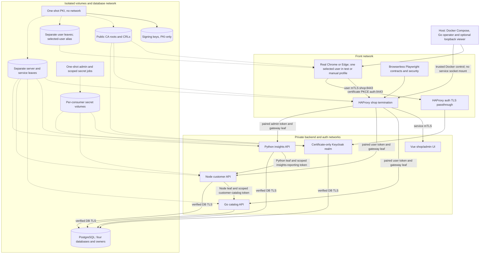

The volume nodes summarize separate scoped mounts; they are **not** shared folders exposing all keys to every service. Each runtime gets its own leaf credentials and required public trust. The manual runner gets only the selected user. The browserless contract job mounts two customer certificates, admin, Node and Python caller certificates plus separate scoped token secrets. The separate security job mounts customer, second-customer and shopkeeper leaves only, with no service secrets. No runtime gets CA signing keys. Backend and database ports are not published to the host. Isolated negative-fixture mounts and the bootstrap job appear in the later workflows.

The [canonical OpenAPI contracts](../contracts/openapi/README.md) specify these three private service origins and both internal paths. Go, Node and Python business paths are observed. Python calls Node's bounded reporting feed with its service certificate and scoped token; it never reads Node's database. Prompt 04 directly exercised certificate-only PKCE login and signed token claims with real Chrome and Edge; the Vue shell initiates that flow and holds tokens in memory.

## 2. Startup and user certificate provisioning

Keycloak supplies the user identity and permissions. The local CA supplies the user's certificate. Provisioning is an operator capability, not a public shop endpoint.

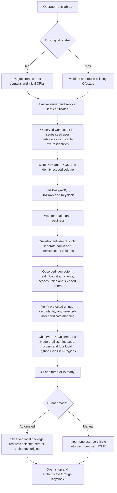

Each dependency waits on a concrete readiness or completed-job result, not a fixed sleep. An already valid user certificate is reused; issuance/renewal does not occur blindly on every startup. Reset remains a separate explicit project-scoped operation.

The seed files and [independent reporting oracle](../seed/README.md) pass an offline container check. The Keycloak realm, users and service clients are **observed** after repeat startup. Go's 14 catalog items persist in `catalog_db`; Node's six profiles and nine initial orders persist in `customer_db`. Python packages four local GeoJSON regions and stores follow-up records in `insights_db`; a restart retained four contract-created notes.

## 3. Certificate login and authorized API access

The browser proves certificate possession twice: to the shop gateway and directly to Keycloak through the tunnel. The resulting user token carries permissions; the APIs also ensure that token identity matches the gateway's verified certificate identity.

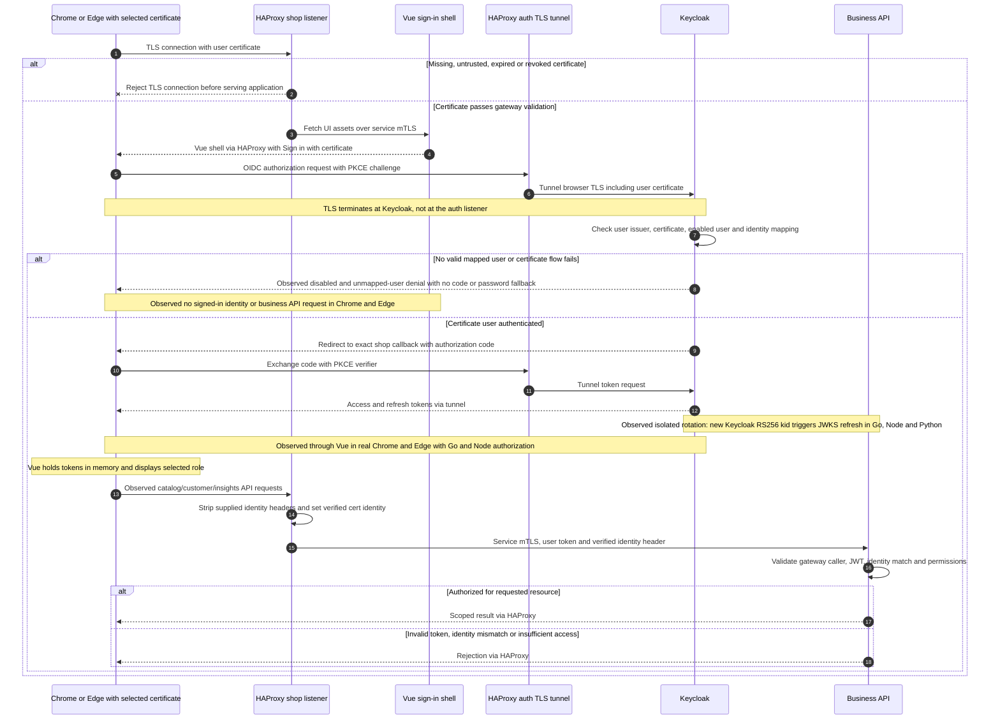

Return arrows abbreviate the proxy path; they do not imply direct backend access. Cached Keycloak cookies cannot substitute for the required certificate identity. A trusted certificate for an unknown/disabled user can load the non-sensitive UI shell, but cannot obtain authenticated business data.

## 4. Checkout and service-to-service authentication

The user's token authorizes creating their order. A different token identifies Node when it requests authoritative prices from Go. The browser never receives that service token.

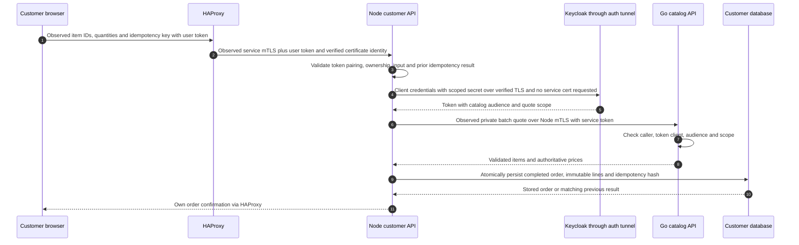

Any failed transport or token check stops the call before business processing. Node does not forward its user's token as its service identity, and it does not accept browser-supplied prices. This is simulated checkout without real payment or atomic stock reservation.

An isolated Prompt 11 fixture removed `catalog.quote` from the default scopes of the `customer-catalog` client. Keycloak then issued a correctly signed, correctly addressed token without that scope; the same Node service certificate and catalog quote request changed from HTTP 200 to 403. The fixture never ran against the retained realm.

## 5. Regional sales, users and follow-up workflow

The Vue customer and administrator screens call the public catalog, customer and insights paths through the shop origin with bearer tokens. Shop search/details, cart/checkout, account/orders/widgets, inventory maintenance, admin lists, regional sales/map and local follow-up controls are implemented. All three providers pass live Playwright contracts. Both Chrome and Edge passed customer checkout/widget and admin reporting/follow-up journeys. Admin region selection reloads the same region across sales, customer/order tables and follow-up list.

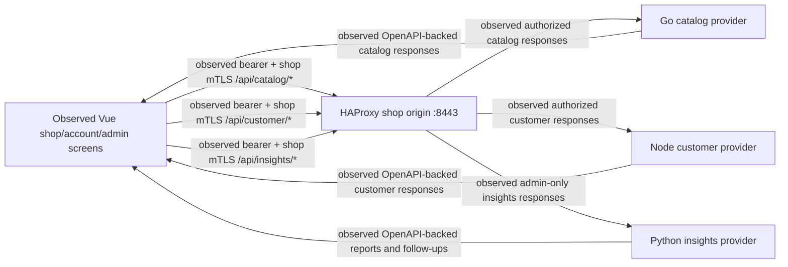

Python checks the requesting administrator before using its own reporting credentials. Region membership comes from historical orders, which can differ from a customer's current address.

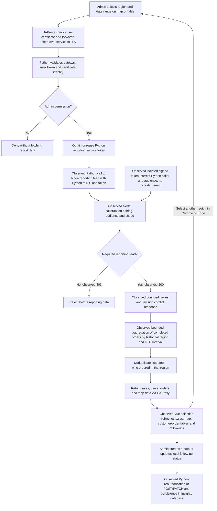

No cross-service database reads or external messages occur. A changing dataset revision produces explicit retriable HTTP 409 rather than mixed totals; the synchronous aggregation caps input at 10,000 orders. The add/remove-widget action follows the user's authenticated API path to Node and persists only that user's permitted widget layout.
The reporting missing-scope check likewise used a disposable realm and the correct Python service certificate; a normal token returned HTTP 200 before its default scope was removed, and a newly issued token without `reporting.read` returned 403.

## 6. Automated tests and selected-user manual mode

Both modes use the same container image and authentication configuration, but differ in how the browser selects its certificate. Native installation is exercised by manual mode; automated tests use Playwright's context certificate support. Prompt 04 also ran headed native-store PKCE checks in both Chrome and Edge without context certificates, against the Compose realm.

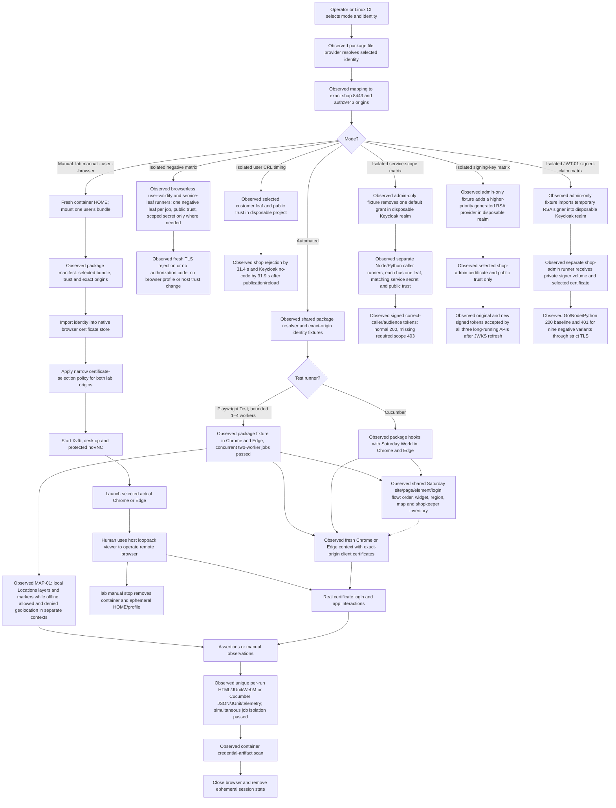

The package manifest drives selected PKCS12 import and exact-origin Chrome and Edge policy generation in the manual runner. Prompt 10 verified one selected identity mount, the loaded native store and brand policy in each browser, and a fresh HOME after switching customer Chrome to admin Edge. A mismatched mounted certificate now fails before browser launch. Both native-store Vue sign-in paths passed in headed checks without injected state. The loopback viewer requires a one-session VNC password; `lab manual stop` removes the container profile while retaining issued certificate volumes. A human later confirmed `shop-admin` in the current Edge viewer and `customer-waterdeep` in the recreated Chrome viewer. No certificate was installed on the host; a read-only before/after trust audit also found unchanged macOS keychain/trust fingerprints. Native Linux amd64 remains unverified.

## 7. Renewal, revocation and existing sessions

Renewal and revocation are separate operations. Revocation affects new TLS handshakes after publication/reload; existing connections and already issued tokens have separate lifetimes.

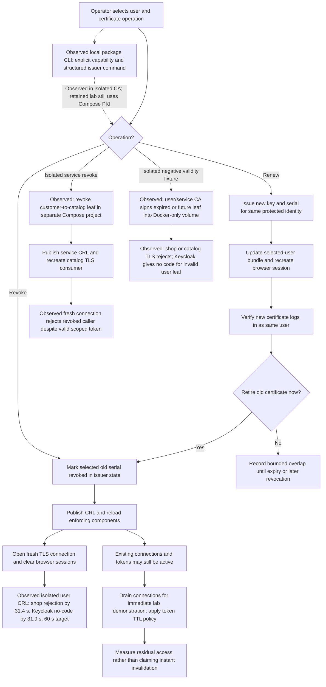

The package issuer adapter and CLI passed provision, renewal, CRL publication and revoked-leaf rejection against an isolated in-memory CA. The retained lab still invokes its existing Compose PKI job for operational lifecycle changes. Observed Prompt 04: renewal retained the protected identity; after CRL publication and explicit HAProxy/Keycloak reload, a new shop TLS connection rejected the revoked certificate and Keycloak issued no code. An earlier isolated run measured shop rejection by 45 seconds without separately timing Keycloak. A later disposable Prompt 11 run measured fresh shop rejection by 31.4 seconds and Keycloak no-code denial by 31.9 seconds from CRL publication completion, including reload and health checks; both met the 60-second target. Prompt 11 also rejected a revoked service leaf and expired/future user and service leaves. Account disable terminated a Keycloak session and rejected refresh and fresh login. An already issued access token had at most 120 seconds remaining. These are Apple Silicon amd64-emulation results, not a native Linux timing bound. Account disable is not interchangeable with revoking a specific certificate. See [revocation expectations](authentication.md#revocation-and-lifetime-expectations).

## 8. OpenAPI implementation and Playwright contract gate

The three canonical specifications pass pinned OpenAPI 3.1 lint, reference
bundling, type generation and offline validator tests. Go, Node and Python
provider responses pass live Playwright contracts and the full 23-operation
coverage gate on Apple Silicon emulation. See [API contract requirements](api-contracts.md).

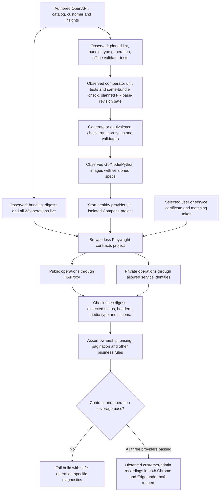

The request contexts use the real providers and exact-origin client certificates. They do not launch a browser. Invalid-input cases intentionally reach the provider, and TLS handshake failures are checked separately from HTTP error schemas.

## 9. Isolated CI gate and report boundary

The workflow is implemented in `.github/workflows/ci.yml`. Its static checks, live contracts/security suite and all eight customer/admin combinations passed in a disposable Compose project on Apple Silicon amd64 emulation and in the second GitHub Linux push. The native scan and cleanup passed; upload failed because the Cucumber telemetry file was mode `0600` and the GitHub host runner could not read it. The file now uses mode `0644` for synthetic, scanner-approved metadata, with an explicit host-readability gate before upload; that final CI path is pending rerun. The actual pull-request base comparison remains unobserved because this was a push. The CI host controls Docker while signing keys, user leaves and service credentials stay in project-scoped volumes and scoped containers.

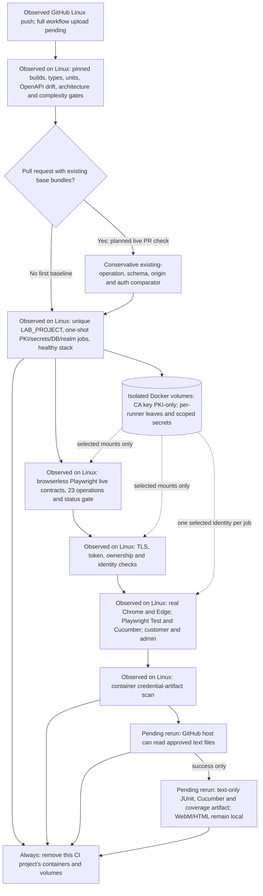

No manual viewer is launched in this CI matrix. The operator's selected-user viewer and certificate lifecycle remain the workflows above; CI's isolated stack uses the same issuance and two exact HTTPS origins, `shop.magic.test:8443` and `auth.magic.test:9443`. No host certificate store is written.

## Prompt 03 PKI overlay (observed on Apple Silicon Docker)

The PKI portion of infrastructure and provisioning is running in
`infra/compose.yaml`. This diagram records the observed certificate order and
credential boundary; shop, service and browser transport now run, while the
realm login and business paths in the main diagrams remain planned. The PKI job has no network or
published port.

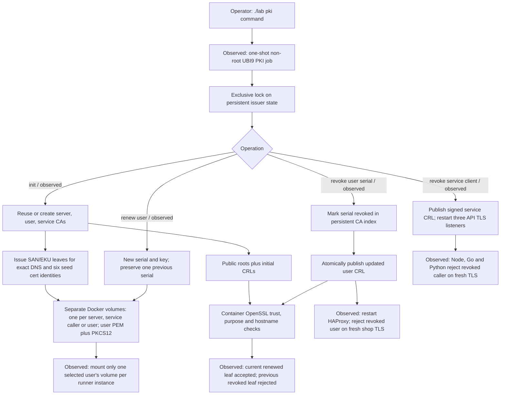

The default project retained its certificates across repeated `init` runs with
the same serial and fingerprint. Isolated projects demonstrated user renewal,
user and service revocation, live gateway/API rejection on fresh connections,
and explicit reset. Prompt 04 subsequently observed Keycloak realm-level user CRL enforcement. Server certificates exist for
`shop.magic.test`, `auth.magic.test`, `ui`, three API DNS names and `postgres`.
PostgreSQL uses the `postgres` server leaf; the shop and three API listeners
now use their exact DNS leaves.

## Prompt 03 database overlay (observed on Apple Silicon Docker)

The database runs on a private Compose network with no host-published port.
The secret job is isolated from that network. The root entrypoint copies the
server key into a postgres-owned runtime path, then PostgreSQL runs as UID 999.
Bootstrap is a repeatable job, not a fixed-time delay.

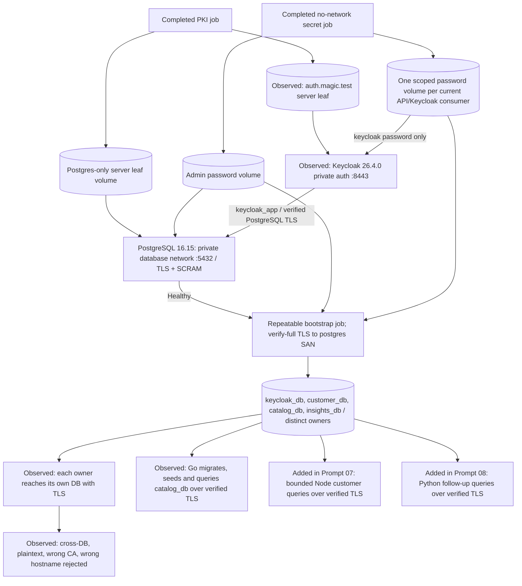

`./lab db init` succeeded on first and repeat runs without replacing the
database. `./lab db verify` checked all four owners and negative boundaries.
Only the intended `:5432` container listener exists; it is not published on the
host. Keycloak is healthy on the private auth network and uses TLS connections
to `keycloak_db`; a container probe validated its direct `auth.magic.test:8443`
server certificate and rejected wrong CA/hostname. The passthrough is observed
in the next overlay. Prompt 04 subsequently implemented the certificate-login realm; Prompts 06–08 added bounded catalog, customer and insights queries. Python uses only `insights_db` for follow-ups and Node's private feed for order reports.

## Prompt 03 gateway and initial static UI overlay (historical Apple Silicon observation)

At the Prompt 03 stage, the UI was a built copy of the imported Vue preview served behind HAProxy; its
business requests are not yet wired to conforming providers. HAProxy has two exact-origin
listeners in one container and no host-published port. The front network has
both `shop.magic.test` and `auth.magic.test` aliases; the private backend also
has `auth.magic.test` for future service token/JWKS calls through the same
issuer origin. The auth and database networks remain private.

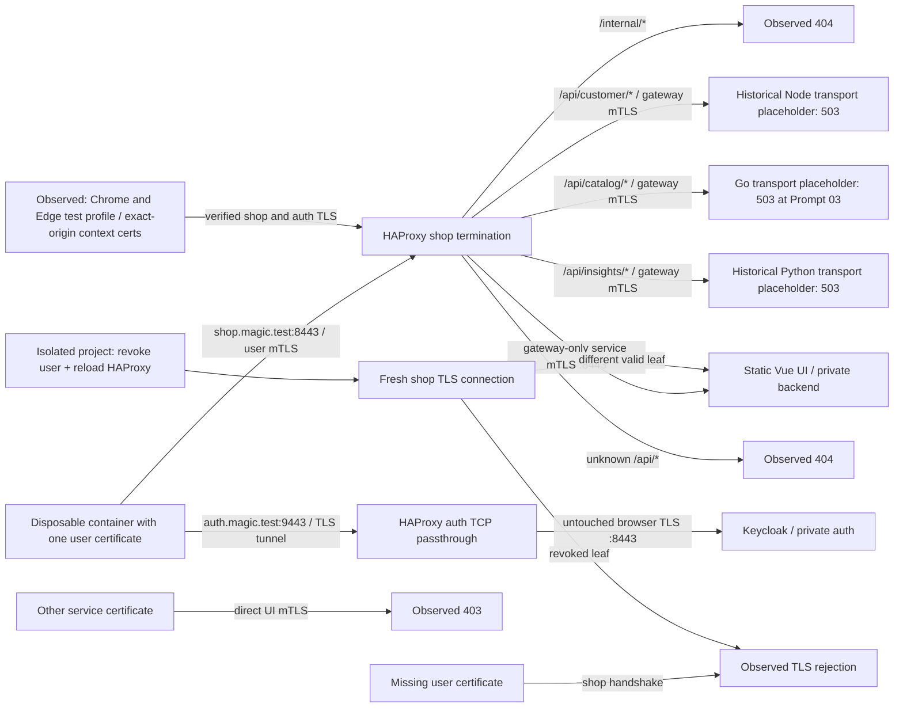

Both exact origins returned HTTP 200 with server verification result zero from
the container probe. Shop no-cert and wrong server CA checks failed. The UI
rejected a missing or wrong service caller on its private HTTPS listener.
After the API placeholders were added, each named `/api/*` prefix returned 503
from its corresponding language container. Direct private probes established
that only `customer-api` transport may reach Go's internal quote placeholder
and only `insights-api` transport may reach Node's internal reporting
placeholder; other trusted service CNs got 403. Those probes are transport
checks, not service-token or OpenAPI contract tests.
Prompt 06 replaced the Go placeholder with a seeded, authorized provider and
live catalog contracts. Prompt 07 did the same for Node and added dynamic Docker
DNS refresh to HAProxy after backend recreation. Prompt 08 then replaced the
Python placeholder with the live insights provider.
The Prompt 03 revocation experiment used a disposable Compose project and removed it with explicit reset afterward. Prompt 04 then configured Keycloak's X.509 realm and tested its CRL rejection in a separate isolated project. The Prompt 03 test profile passed actual Chrome/Edge transport checks, and the manual profile launched both native browsers with a selected-user certificate. Prompt 04 direct runner PKCE login passed in both channels; later Prompt 10 human viewer checks confirmed both selected roles on Apple Silicon emulation.

## Prompt 03 runner profile overlay (observed on Apple Silicon Docker)

The `test` and `manual` profiles use the same pinned Bookworm amd64 image with
Chrome 155.0.8059.39-1, Edge 154.0.4258.62-1 and Playwright 1.61.0. The
browser image runs as UID 1000. Its signed package dependency closure is pinned
in `testing/container/apt.lock`; the public server CA enters its NSS database,
and Node's Playwright request client uses the same CA through
`NODE_EXTRA_CA_CERTS`. The observed recorded Playwright Test slice uses the
Playwright 1.61.0-pinned FFmpeg revision 1011 to produce local WebM videos and
HTML/JUnit reports. No TLS verification bypass is configured.

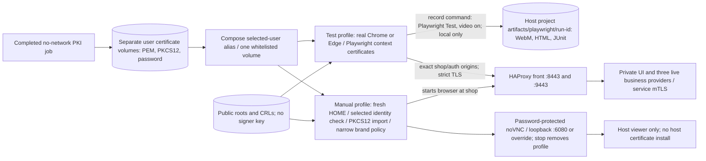

Both browser channels returned 200 at the shop and Keycloak's master realm
discovery endpoint with a selected user certificate, 503 for a placeholder API
and 404 for public `/internal/*`. Missing client certificates and wrong server
hostnames failed. The manual Chrome store held the customer certificate; a
recreated Edge desktop held only the admin certificate. The native policy and
browser process were verified. The manual viewer was bound to `127.0.0.1:6081`
because the older spike viewer still occupies the default 6080. Human login
against this Compose realm remains unverified, though Prompt 04 direct Chrome/Edge PKCE tests passed. Prompt 11's shared Saturday Playwright Test and Cucumber customer/admin journeys now pass against the live stack in Chrome and Edge. The earlier recorded UI slice was fixture-backed and remains separate evidence; the broader negative matrix is still open.

## Early Prompt 09 UI authentication overlay (observed on Apple Silicon Docker)

The Vue shell now initiates the same certificate-only PKCE flow proven in Prompt 04. The authentication adapter starts before the router so it can process and clear the callback. Tokens remain in adapter memory; only the transient PKCE callback state uses browser storage. The user-facing role is derived from the returned token, while eventual business API permission checks remain server responsibilities. A signed-in catalog request now reaches the Go provider, which validates the signed token and gateway certificate identity.

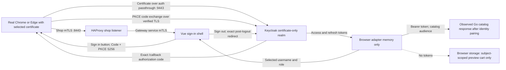

Observed tests covered Chrome/customer and Edge/shop-admin sign-in and sign-out with context certificates and with native NSS installation/policies, disabled-user rejection, token absence from browser storage, catalog bearer propagation and customer-to-admin preview-cart isolation. All three business providers subsequently passed live contracts; the final Prompt 09 UI matrix covered customer and admin journeys in both browser brands.

## Prompt 13 operator control

Prompt 13 adds a local operator. The trusted host runs its binary and Docker CLI; the UI, three business APIs, Keycloak and both runner modes receive no Docker socket. The operator's `status`, `healthcheck` (`health` alias), `certs` and `telemetry` views were observed on Apple Silicon. Healthcheck requires all seven core services healthy and also checks the manual viewer when present. Its test and diagnostic actions call the existing containerized suites. The separate `diagnose-revoked --yes` action passed in a disposable project and removed only its own volumes; the ordinary `diagnose` action does not change CRLs.

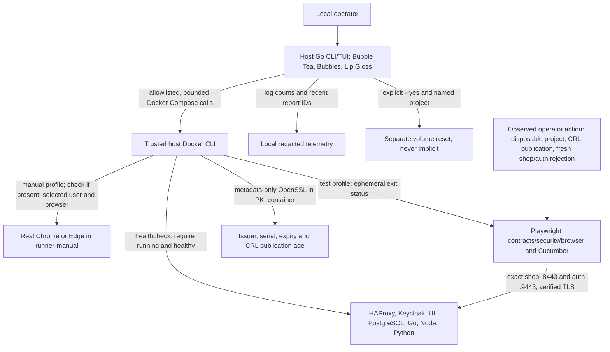

## Keeping the diagrams accurate

- After prompt 01, reconcile actual browser/base/architecture choices and both authentication origins.
- After prompts 03–04, reconcile Compose services, ports, networks, credential mounts, startup dependencies and Keycloak flow behavior.
- After prompts 06–11, reconcile API routes, OpenAPI contract gates, service-token scopes, reporting logic, runner adapters and manual desktop lifecycle.
- During prompt 12, render every Mermaid block, check legibility, and trace each arrow to implemented configuration or an observed test. Keep unimplemented behavior explicitly labeled as planned.
- Maintain editable Mermaid blocks in Markdown as the source of truth. If exported SVG/PNG figures are added for teaching, generate them from these blocks with a pinned containerized renderer and check them for drift.

## Prompt 01 implementation overlay (Apple Silicon runtime proof)

The eight diagrams above remain the full-stack plan. The spike presently uses the
following smaller workflow. No regional reporting, service client-credentials flow,
PostgreSQL, portable Keycloak package or full UI has been implemented by this overlay.
Their planned diagrams and three-language/OpenAPI requirements still apply.

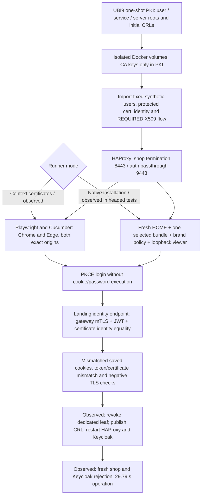

Customer and admin PKCE login passed in both branded browsers under both runners.
All four headed native-store user/browser pairings passed, and a human completed
customer login through the loopback viewer. Native Linux amd64 remains unverified;
completion note 01 records the bounds.

## Prompt 02 import overlay (build-time observation)

This diagram records the imported component without implying that it is deployed
behind HAProxy or authenticated by Keycloak yet. The full-stack diagrams above
remain the intended runtime workflow.

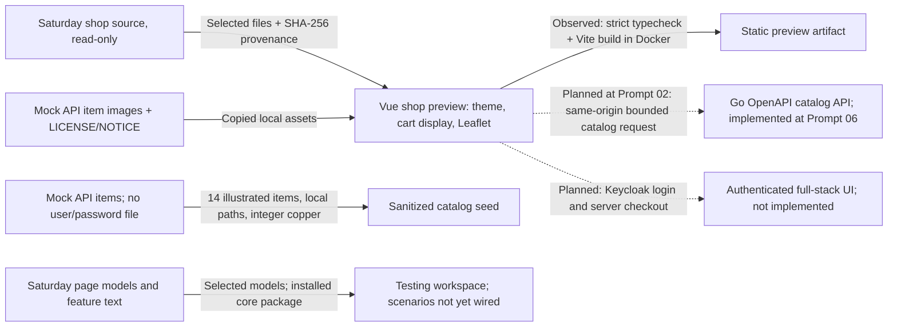
