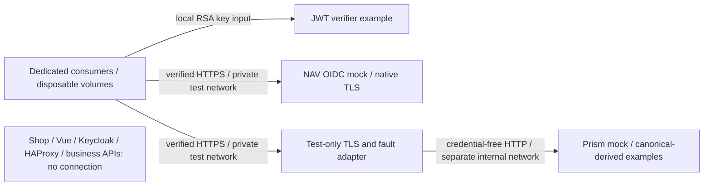

# Replacing dependencies in isolated tests

These three examples teach dependency replacement in **dedicated test consumers**.
They never start, connect to, or reconfigure the shop, its APIs, Keycloak or HAProxy.
Mock passes are not live-provider, real-login, certificate-identity or authorization evidence.
The shop remains certificate-only; the separate lesson still requires certificate and password.

From the repository root, with Docker Desktop running:

```sh
./spikes/mock-auth/run.sh jwt   # FEATURE-01
./spikes/mock-auth/run.sh oidc  # FEATURE-02
./spikes/mock-auth/run.sh api   # FEATURE-03
./spikes/mock-auth/run.sh all   # run in that order in a fresh project
```

Each command builds in a digest-pinned Node container, checks canonical contract
lint/drift/types and the existing six Ajv validator tests, then creates its own
`cert-mock-<timestamp>-<pid>` project. Docker is the only host runtime needed.
No published ports, host trust changes, real credentials or Docker socket mounts.
Tests have request deadlines and a 90-second overall consumer deadline.
Every invocation starts with fresh volumes; success, failure, INT and TERM trigger
project-scoped cleanup and assertions that its containers, volumes and networks are gone.
A forcibly killed host process or unavailable Docker daemon cannot run its trap;
recover only the printed project with:

```sh
docker compose -p cert-mock-REPLACE-WITH-PRINTED-PROJECT -f spikes/mock-auth/compose.yaml down --volumes --remove-orphans --timeout 5
```

To demonstrate cleanup after a failing container while all mock servers are running:

```sh
MOCK_FORCE_FAILURE=1 ./spikes/mock-auth/run.sh all
# Expected exit 1, followed by "Cleanup verified: cert-mock-...".
```

| Example | What is replaced | What the test proves | What it does not prove |
| --- | --- | --- | --- |
| FEATURE-01 | Token issuer/key input to a small standalone verifier | An ephemeral RS256 signature and synthetic lab-shaped claims are accepted; signed expiry/audience failures and a flipped signature byte are rejected for their specific reasons | User login, Keycloak claims/mappers, production verifier equivalence, certificate pairing or real API access |
| FEATURE-02 | OIDC dependency of a dedicated token consumer | Native verified HTTPS discovery, exact issuer, issuer-specific JWKS, client-credentials token verification; ten fail-closed cases and a fresh successful request after an outage probe | Client-secret authenticity, user credentials, certificate selection, authorization-code/PKCE, refresh, revocation, Keycloak flows or business authorization |
| FEATURE-03 | Catalog HTTP dependency of a standalone `CatalogConsumer` | Canonical-derived populated/empty/error fixtures, invalid query rejection, required 201 Location and bodyless 204; errors/timeouts/malformed data clear prior success; a fresh request recovers | Real catalog/provider behavior, checkout/database effects, Vue behavior, client certificates, token validation or API authorization |

`jwt.mjs` contains the **example verifier**, not a production replacement.
The OIDC mock requires a secret-shaped request but accepts the generated test
secret without a real registered client: its 401 tests request shape, not real
client authentication. Unsupported grants return 400 `invalid_grant` in the pinned
release, not the normative `unsupported_grant_type`. Expired tokens are minted
by a separate configured issuer and checked using that issuer's own JWKS.
The ten negatives are audience, issuer, signature, missing key, expiry,
missing client secret, unsupported grant, wrong CA, wrong hostname and refused connection.
The refused connection uses the same mock hostname on unopened port 1; it is a
transport failure probe, not a claim that the actual issuer went down.

Prism receives a **volume-held derivative** of the read-only canonical catalog
bundle. `prepare.mjs` adds named fixtures after checking them with the existing
`testing/api/contracts/validator.ts` Ajv functions. Only this derivative removes
security metadata, because mock security schemes cannot prove application security.
Paths, parameters, body schemas, response schemas and headers stay canonical.
The original OpenAPI files, generated artifacts and application configuration are unchanged.

`FAULT_wrong_type` is **intentionally invalid**: `priceCopper` is a string.
Ajv must reject it before tests start. The TLS adapter serves this labelled fault
outside Prism's normal examples so an invalid fixture cannot be mistaken for a
valid canonical example. The same adapter delays one explicitly marked request
by 800 ms; the consumer aborts at 250 ms, checks a bounded observed duration and
clears prior success. Recovery is a new request without the fault flag, with no
mutable sequence counter or automatic retry of writes.



The API adapter is necessary because Prism's mock listener is HTTP. Its fixed
upstream is only `prism:4010`, on another internal network the consumer does not
join. The consumer verifies the adapter's CA and `api` hostname; wrong CA and
hostname are asserted to fail. The adapter strips authorization/cookie headers
and never injects authentication. The internal HTTP mock hop is an explicit
local test trust boundary, **not end-to-end TLS or upstream mTLS evidence**.
OIDC uses its own native TLS listener and also rejects wrong trust/hostname.

The private CA key, TLS leaves, JWT signing key, fixture tokens and generated
client secret are container-created and stored only in disposable Docker volumes.
OIDC signing state is ephemeral in the mock process; temporary JVM files use
container-local tmpfs. No browser/profile is created. Logs for mock servers are
disabled, no request dashboards are published, and tests print only case summaries.
See [completion 16](../../docs/completion/16-mocking-examples.md) for pinned
versions, exact observed commands/results and the deliberately bounded Prism decision.

## Record a fresh run

With the lab's existing `magic-shop-runner:03` image available:

```sh
./spikes/mock-auth/record.sh all
# Or: ./spikes/mock-auth/record.sh jwt|oidc|api
```

This starts a no-network Chrome recording container and reruns the actual example
commands. Videos show a live output viewer, not application browser journeys or
replayed historical reports. Routine Docker output is filtered for readability;
the untouched execution transcript is saved beside each video. The viewer shows
what is mocked, the assertions, limitations, exit result and project cleanup.
Chrome is only the recorder. Its HOME and temporary profiles stay in disposable
Docker volumes, removed by the recorder's cleanup trap. The script pins the local
recorder image ID at startup and prints the output directory and image identity.

## Browser journeys and adoption

The examples above run dedicated browserless consumers. The separate
[browser suite](browser/README.md) runs the unchanged Vue build with intercepted
auth/API responses and a standalone OIDC browser consumer against the NAV mock.
It records actual app interactions in Chrome/Edge under Playwright/Cucumber.
These are distinct from the live-output-viewer videos produced by `record.sh`.
The observed 56-case matrix is documented in
[completion 17](../../docs/completion/17-browser-mock-consumers.md).

To build these patterns into another app, use the
[M00–M05 adoption prompts](../../docs/mock-testing-adoption-prompts.md).
Map that app's actual origins, auth adapter, contracts and roles before copying
test seams; the fixed Magic Shop paths and local runner image are reference-specific.
