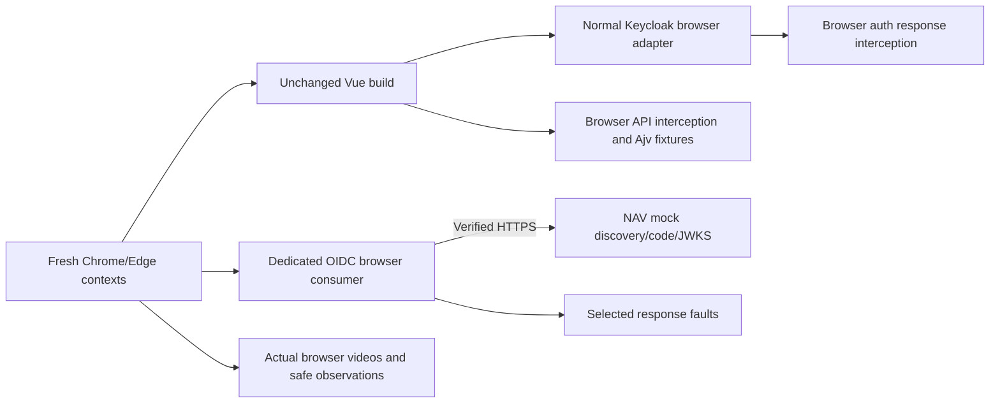

# Browser consumers with mock authentication

Run from the repository root with Docker Desktop running and the existing locked
`magic-shop-runner:03` image available. If absent, build only the runner
(no live services need to start):

```sh
docker compose -f infra/compose.yaml --profile test build runner-test
```

Then run:

```sh
./spikes/mock-auth/browser/run.sh
# One browser / runner:
MOCK_BROWSERS=chrome MOCK_RUNNERS=playwright ./spikes/mock-auth/browser/run.sh
# A bounded individual Playwright scenario:
MOCK_BROWSERS=msedge MOCK_RUNNERS=playwright MOCK_SCENARIO=customer ./spikes/mock-auth/browser/run.sh
```

The default runs fourteen scenarios through Playwright and Cucumber in real
Chrome and Edge. `MOCK_SCENARIO` selects Playwright scenarios only. Every run
builds the unchanged Vue application, generates fresh test certificates, creates
an internal network, records each browser context, and removes its containers,
network and credential/profile volumes. Recordings and sanitized observations
are under `artifacts/mock-browser/<project>/<runner>-<browser>/`.

## What is replaced

The Vue suite intercepts the Keycloak adapter's authorization, token and logout
responses and all business API requests. It checks state/nonce behavior, matching
S256 challenge/verifier, role navigation, account/widget behavior, checkout,
retained cart and idempotent manual recovery after 403, 503, timeout and malformed
JSON. Valid responses and requests pass the existing canonical OpenAPI Ajv
validator. `checkout-malformed` is intentionally invalid JSON and deliberately
bypasses response validation. Synthetic signed tokens remain in Docker volumes.

The separate OIDC browser consumer talks to the pinned NAV mock over verified
HTTPS. It uses discovery, authorization code, S256 parameters and JWKS/WebCrypto
verification of its ID token, including issuer, audience, expiry and nonce. Its
failure cases replace discovery/token responses or alter the signature, then
verify recovery. It never calls business APIs.

## What the evidence means

These are consumer and UI tests. They do not prove real login, Keycloak client
configuration, HAProxy routing, certificate/account pairing, API authorization,
provider PKCE enforcement, or the certificate-plus-password teaching flow.
Vue's production authentication remains unchanged. The test static server has
a separate synthetic mutual-TLS gate; TLS probes reject missing client
certificates, wrong CA and wrong hostname. Mock tokens never reach real APIs.
Browser contexts keep TLS verification enabled and block service workers.
No network ports are published; no traces, HAR or saved storage states are
exported. Recordings carry a mock-evidence label. Browser binaries execute in
Linux containers on macOS Docker Desktop; this is not native Linux-host evidence.

See the completion note for exact observed versions, commands and results.

## How the two browser paths work

The wrapper uses the base example Compose file plus `browser/compose.yaml` in a
fresh `cert-mock-browser-<timestamp>-<pid>` project. `Ui.Containerfile` typechecks
and builds the existing Vue sources. `server.mjs` serves that build on the shop
and auth origins with a synthetic mutual-TLS gate. It does not implement business
APIs or an authentication provider. The normal app's fixed issuer/callback stays
unchanged; private network aliases resolve those origins to this test server.

For Vue journeys, `journeys.mjs` intercepts requests at the browser context:

1. The normal Keycloak adapter creates its authorization request and PKCE
   challenge. The test captures state/nonce and returns a synthetic callback.
2. The adapter sends its code and verifier. The test checks the code and matching
   S256 hash, then returns ephemeral signed tokens with customer/admin claims.
   Denied, wrong-state and invalid-role cases take the app's existing error paths.
3. API calls receive `fixtures.mjs` responses after canonical Ajv validation.
   Fault scenarios replace the first checkout response, then allow manual retry.
4. Assertions inspect the actual Vue UI and mock counters. The static server's
   audit endpoint must show zero escaped auth/API requests. Unexpected origins
   fail the test. Context close finalizes its video and removes the active session.

This browser path tests the adapter and UI consuming synthetic identity. Vue
claim handling is not an API signature-verification test. The standalone JWT
example and OIDC consumer perform their own cryptographic verification; real APIs
still require independent live authorization evidence.

The OIDC path opens `oidc-consumer.html`, a dedicated teaching page. It redirects
to NAV's actual mock authorization endpoint, exchanges the returned code, loads
JWKS, and verifies the ID token using WebCrypto. Browser interception supplies
only the selected discovery/token/signature fault; ordinary OIDC traffic reaches
the mock over verified HTTPS. Failed flows retry from a new transaction and must
recover. This page has no shop API integration.



| Scenarios | Behavior asserted |
| --- | --- |
| `customer`, `admin` | Customer checkout/account/widgets/logout and admin views/role navigation |
| `auth-denied`, `wrong-state`, `invalid-claims` | Existing auth error shown; no signed-in identity or API calls |
| `refresh-failure` | Browser clock advances expiry; refresh rejection clears the identity |
| `checkout-403`, `checkout-503` | Structured contract-valid failure retains cart; manual retry succeeds |
| `checkout-delay` | App's 10-second deadline clears pending work; retry recovers |
| `checkout-malformed` | Intentionally invalid JSON cannot show successful order; retry recovers |
| `oidc-success` | Dedicated consumer verifies the mock ID token |
| `oidc-discovery-failure`, `oidc-token-failure`, `oidc-signature-failure` | Dependency/token/signature failure cannot show verified identity; fresh flow recovers |

Checkout assertions prove the mock saw the same idempotency key on manual retry
and one simulated success. They do not prove database atomicity or real-provider
idempotency. The browser auth subject and API profile subject are synthetic
fixtures; their production identity pairing is not under test.

## Inspect recordings and recover interrupted runs

Each successful default run exports 56 WebM files plus `versions.json`,
`environment.txt` and per-selection `observations.jsonl`. Open a video's exact
path printed under the project directory. Videos capture the browser content,
including a test-injected mock-evidence badge; they omit the address bar and
network inspector. Reports contain assertions/counters, not bearer values.
The artifact scanner checks filenames and text, not video pixels. Do not enable
trace/HAR/storage-state exports without designing credential-safe handling.

To test the failure cleanup path:

```sh
MOCK_BROWSERS=chrome MOCK_RUNNERS=playwright MOCK_SCENARIO=wrong-state MOCK_FORCE_FAILURE=1 ./spikes/mock-auth/browser/run.sh
# Expected exit 1 and Cleanup verified for that project.
```

If the host is forcibly killed or Docker is unavailable, the cleanup trap cannot
complete. Use the exact printed project, never a broad Docker prune:

```sh
MOCK_BROWSER_REPORT_DIR="$PWD/artifacts/mock-browser/REPLACE-PROJECT" \
  docker compose -p REPLACE-PROJECT \
  -f spikes/mock-auth/compose.yaml -f spikes/mock-auth/browser/compose.yaml \
  down --volumes --remove-orphans --timeout 5
docker image rm cert-mock-browser-base:REPLACE-PROJECT
```

To adopt the patterns, follow [M00–M05](../../../docs/mock-testing-adoption-prompts.md).
Build a target-specific runner and fixtures; do not depend on this lab's local
image, internal import paths or fixed origin strings.
